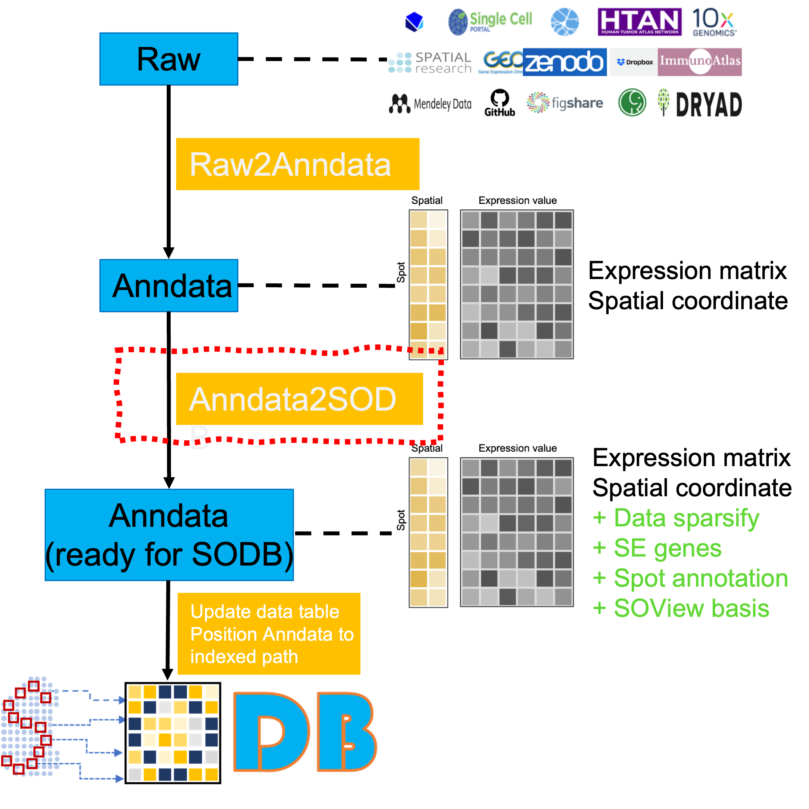

## Overall
This directory contains the code for converting data from Anndata (output of Raw2Anndata) into the Anndata ready for SODB, as shown in the red dotted box in the figure below. The codes are organized according to different spatial omics techniques.

[**This file**](explore_templete.ipynb) is a templete file for new data updating.

