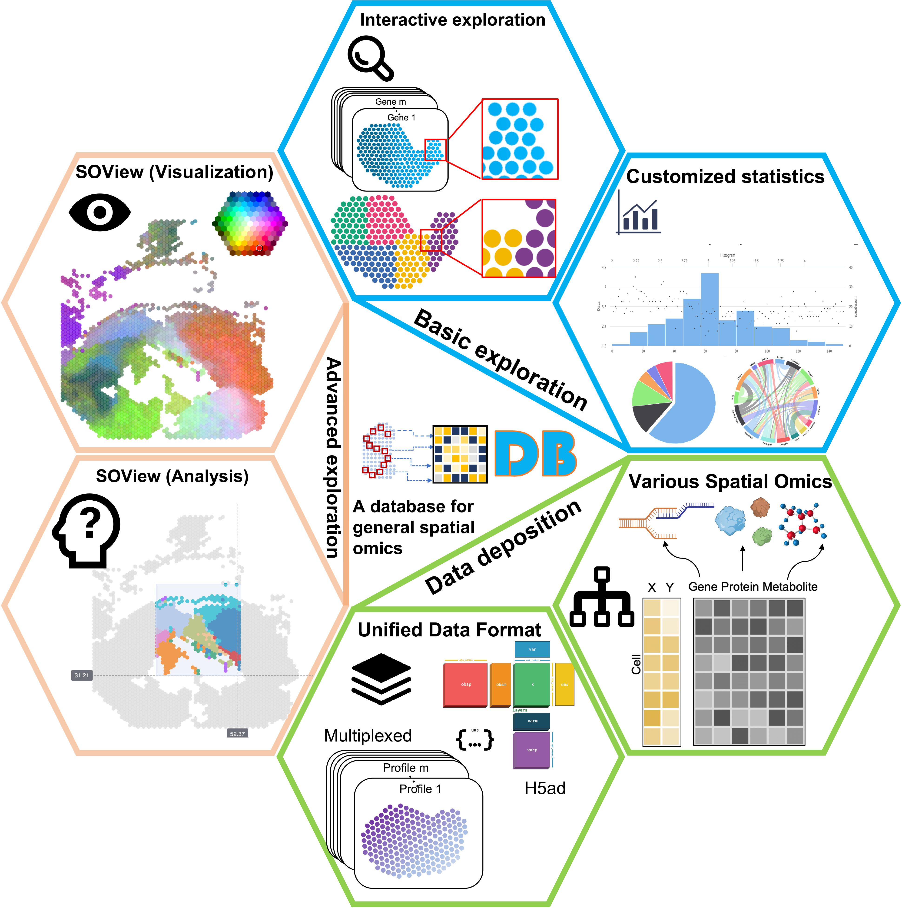

## Overall
  New: A command-line version of SOView is available at [**SOView**](https://soview-doc.readthedocs.io/en/latest/index.html)

 This repo contains code related to [**SODB**](https://gene.ai.tencent.com/SpatialOmics/) and 
its companion command-line package [**pysodb**](https://github.com/TencentAILabHealthcare/pysodb).
- Data Processing
- Figure Regeneration
- Benchmarking 
- Demonstration

## SODB overview

## Key resources
|  Category | Purpose   |  Figure | Code |
| :------------: | :------------: | :------------: |:------------: |
| Website| Website of SODB | None |[Link](https://gene.ai.tencent.com/SpatialOmics/)|
| Website| Website of pysodb | None |[Link](https://pysodb.readthedocs.io/en/latest/index.html)|
| Data Processing | Process Raw data to Anndata format | None |[Link](Raw2Anndata/)|
| Data Processing | Process Anndata format to SODB ready | None | [Link](Anndata2SODB)|
|Figure Regeneration | Compare with related works | Fig. 1g | [Link](FigureGeneration/Figure1g.ipynb)|
|Figure Regeneration | Timeline plot of spatial omics | Fig. 2a | [Link](FigureGeneration/Figure1g.ipynb)|
|Figure Regeneration | Pie chart of category statistics of datasets | Fig. 2bcdgh | [Link](FigureGeneration/Figure2bcdgh.ipynb)|
|Figure Regeneration | Tree plot of human and mouse studies | Fig. 2ef | [Link](FigureGeneration/Figure2ef.ipynb)|
|Figure Regeneration | Boxplot of SE features and data sparsity | Fig. 2ij | [Link](FigureGeneration/Figure2ij.ipynb)|
|Figure Regeneration | Other figures | Fig. 3~5 | Generated by [SODB website](https://gene.ai.tencent.com/SpatialOmics/)|
|Figure Regeneration | Computational methods covered by review papers | Fig. 6a | [Link](FigureGeneration/Figure6a.ipynb)|
|Figure Regeneration | Methods supported by SODB | Fig. 6bcd | [Link](FigureGeneration/Figure6bcd.ipynb)|
|Figure Regeneration | Datasets frequency analysis | Fig. 6ef | [Link](FigureGeneration/Figure6ef.ipynb)|
|Figure Regeneration | 4i spatial proteomics analysis | Fig. S14 | [Link](FigureGeneration/FigureS14.ipynb)|
|Figure Regeneration | Country distribution | Fig. S6 | [Link](FigureGeneration/FigureS6.ipynb)|
|Benchmarking | Benchmark analysis of data loading | Fig. S24 | [Link](Benchmark_time_memory/Benchmark_chen2021dissecting.ipynb)|
|Benchmarking | Benchmark analysis of spatial domain | Fig. S25~42 | [Link](Benchmark_domain/)|
| Demonstration | Tutorial of pysodb |None| [Link](https://pysodb.readthedocs.io/en/latest/index.html)|
| Demonstration | Demonstrate the compatibility with SCANPY and Squidpy |Fig. 1| [Link](Demonstration/)|

## Cite
 
Yuan, Z., Pan, W., Zhao, X. et al. SODB facilitates comprehensive exploration of spatial omics data. Nat Methods (2023). https://doi.org/10.1038/s41592-023-01773-7

 
Spatial Omics DataBase (SODB): increasing accessibility to spatial omics data. Nat Methods (2023). https://doi.org/10.1038/s41592-023-01772-8

