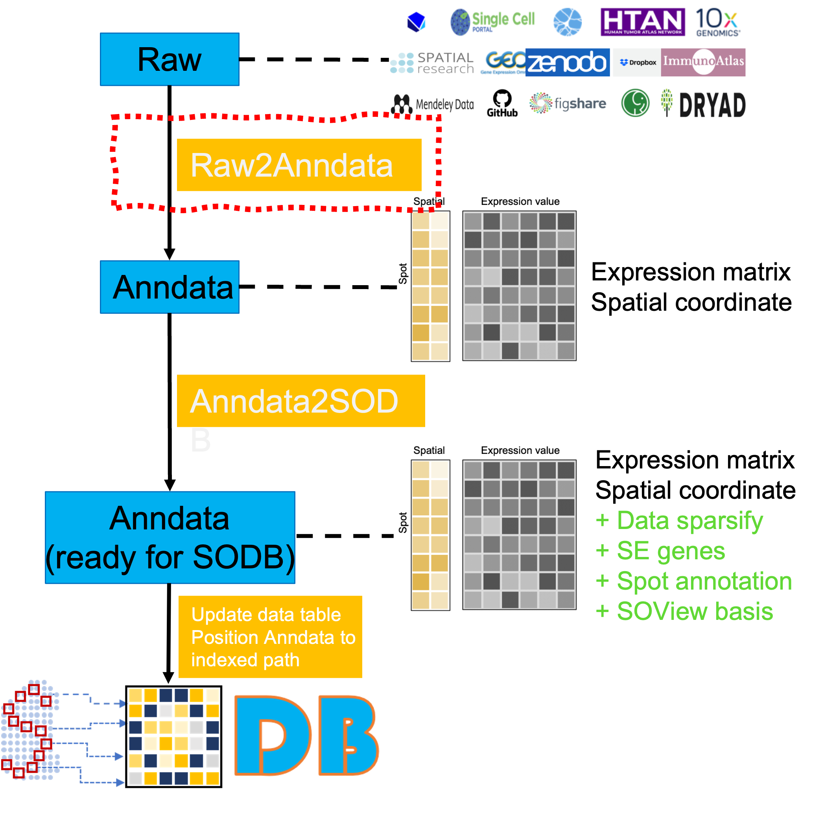

## Overall

This directory contains the code for converting raw data from different sources and formats into the unified Anndata format, as shown in the red dotted box in the figure below. The codes are organized according to different spatial omics techniques.

